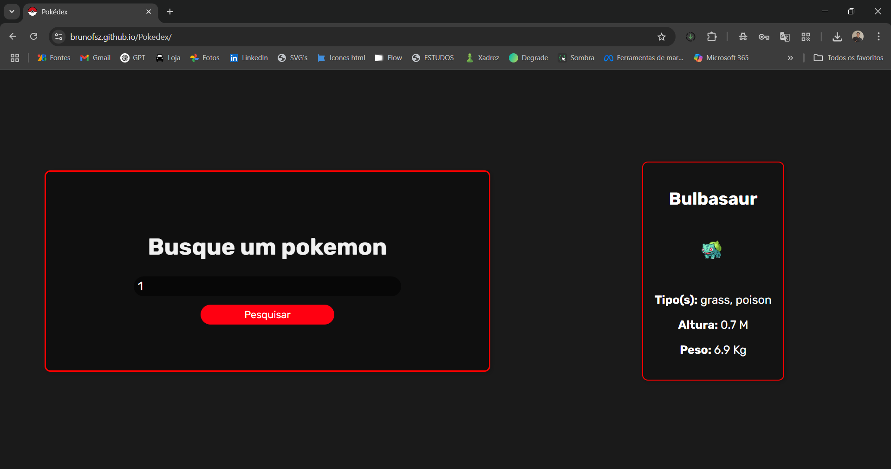

# Pokédex

Este é um projeto simples de uma **Pokédex** desenvolvida com **HTML, CSS e JavaScript puro**. O objetivo é permitir que o usuário visualize informações detalhadas de diversos Pokémon utilizando uma API pública.

## 🔢 Funcionalidades

- Busca de Pokémon por nome ou número
- Exibição de imagem, nome, número e tipo do Pokémon
- Layout responsivo e interativo

## 🧠 Tecnologias utilizadas

- HTML5
- CSS3
- JavaScript (Vanilla JS)

## 💻 Como usar

- Abra o link "https://brunofsz.github.io/Pokedex/" no seu navegador

     OU

1. Clone o repositório
2. Abra o arquivo `index.html` no seu navegador

## 📸 Preview

